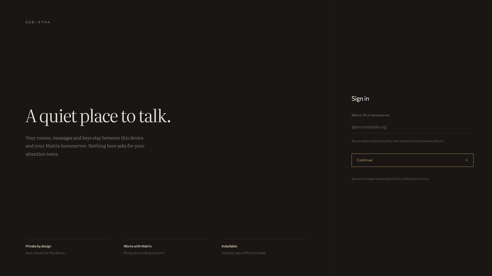
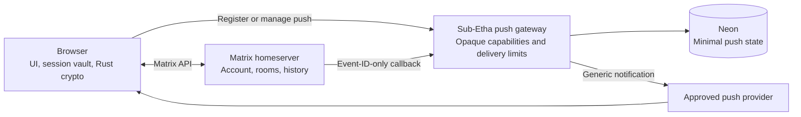

# Sub-Etha

**A quiet place to talk on Matrix.**

Sub-Etha is an installable, browser-first Matrix client. It connects an existing Matrix account directly to its homeserver, keeps session and encryption state on the device, and uses a deliberately narrow backend for privacy-minimal closed-app notifications.



[Quick start](#quick-start) | [Privacy model](#privacy-by-design) | [Architecture](./docs/architecture.md) | [Production push](#production-push)

## Why Sub-Etha

### Your Matrix account, directly

Bring an existing Matrix account and homeserver. Sub-Etha discovers the server, negotiates the authentication methods it supports, and keeps Matrix traffic between the browser and that server.

### A local session vault

Session credentials and the local encryption-store key are sealed at rest in the browser. End-to-end encryption is backed by the Matrix Rust crypto implementation, while optional encrypted key backups remain on the selected homeserver.

### A focused interface for real conversations

Virtualized timelines keep long rooms bounded, drafts survive room changes, Matrix media is fetched defensively and validated before display, and the responsive shell works across desktop and mobile layouts.

### Notifications without message content

The installable app can receive generic closed-app notifications. Its push gateway works with opaque capabilities and minimal Matrix metadata; it does not need account credentials, room names, sender names, or message bodies.

## Privacy by design

Matrix remains browser-owned. Authentication, sync, encryption, decryption, message content, private media, and account persistence stay between the browser and the selected homeserver. The deployment backend serves the app and handles only the Web Push lifecycle.



The backend may persist separately hashed delivery and management capabilities, Web Push subscription material, short-lived endpoint-confirmation challenges, timestamps, aggregate gateway counters, and event IDs used for delivery deduplication. Successful notification callbacks trigger cleanup of deduplication records older than seven days; this is a traffic-driven cleanup window, not a hard retention guarantee. Supported backend paths do not persist Matrix user IDs, room IDs, sender or room names, message content, access tokens, encryption keys, or synced history. Sub-Etha application code does not request, log, or persist client IP addresses; infrastructure-provider logging is outside this application boundary.

The sealed session vault and Rust crypto store use IndexedDB. Timeline sync is held in memory and rebuilt from the homeserver after a reload.

The service worker is intentionally limited to push handling and an inert offline response. It does not cache or replay the application shell or Matrix history.

YouTube previews are browser-direct and lazy. When a preview enters the viewport, the browser sends the public video ID and ordinary network metadata to the YouTube CDN only; Sub-Etha sends no request to its backend and shares no Matrix credentials, room or user identity, or other message content. Other providers and general-purpose unfurling require a separate privacy and security review. See [ADR-0022](./docs/adr/0022-browser-only-youtube-thumbnails.md).

For the complete boundary and state-ownership map, read [Architecture](./docs/architecture.md).

## Quick start

### Run it entirely on your machine (easiest)

The only prerequisite is [Docker](https://docs.docker.com/get-docker/). From the repository root:

```bash
docker compose up --build -d
```

Then open <http://localhost:3000>. That single command builds the app, starts a local PostgreSQL database, applies migrations, generates Web Push keys, and serves the client. Data survives restarts in named volumes; see the [local Docker guide](./docs/local-docker.md) for logs, resets, port overrides, using it from your phone or another device, and troubleshooting.

### Browser and interface development

Node.js development requires Node.js 22.13 or later and uses the committed npm lockfile.

```bash
npm ci
npm run dev
```

Vite prints the local URL. Push routes require PostgreSQL and VAPID configuration; a linked Vercel project can provide them through `.env.local`:

```bash
npx vercel env pull .env.local --yes
npm run db:migrate
npm run dev
```

Use [`.env.example`](./.env.example) when configuring an environment manually. Matrix OAuth requires the deployed HTTPS origin. Password, legacy SSO, and access-token login remain available locally when supported by the homeserver.

## Verification

Run the complete local release gate before handing off a change:

```bash
npm run check
```

This checks formatting and lint rules, runs TypeScript and unit tests, builds the application, and executes the Playwright browser suite.

When `db/schema.ts` changes, generate and apply the matching Drizzle migration:

```bash
npm run db:generate
npm run db:migrate
```

Apply compatible database additions before deploying code that depends on them.

## Project guide

| Area                 | Responsibility                                                                     |
| -------------------- | ---------------------------------------------------------------------------------- |
| `app/components/`    | Application shell, login, rooms, timeline, composer, and settings                  |
| `app/styles/`        | Semantic tokens, shared primitives, and component presentation                     |
| `lib/matrix/`        | Matrix authentication, SDK lifecycle, crypto, media, and normalized UI data        |
| `lib/push-*.ts`      | Push validation, delivery policy, rate budgets, and persistence boundary           |
| `db/` and `drizzle/` | PostgreSQL/Drizzle schema, repository connection, driver selection, and migrations |
| `tests/`             | Unit, integration, security-boundary, browser, and visual coverage                 |
| `docs/`              | Current architecture, code conventions, and durable decisions                      |

Start with the [architecture map](./docs/architecture.md), use the [active ADRs](./docs/adr/README.md#active-decisions) for durable rationale, and follow the [codebase conventions](./docs/code-conventions.md) for routine development.

## Production push

The production push path runs on Vercel with Neon PostgreSQL. Notifications are generic: opening Sub-Etha fetches the event directly from the homeserver and decrypts it in the browser when the room is encrypted. Push is intentionally unavailable on Vercel preview deployments.

<details>
<summary>Owner-run production configuration and rollout notes</summary>

Everything in this expanded section changes external production infrastructure and must be performed by the deployment owner. Provision Neon through the Vercel Marketplace and configure the following values before enabling closed-app notifications:

```dotenv
DATABASE_URL=<provided by Neon>
DATABASE_URL_UNPOOLED=<provided by Neon>
VAPID_PUBLIC_KEY=<public key>
VAPID_PRIVATE_KEY=<private key>
VAPID_SUBJECT=https://your-production-origin.example
PUSH_ENDPOINT_HOSTS=
PUSH_MAX_SUBSCRIPTIONS=10000
PUSH_MAX_REVOKED_MANAGEMENT_KEYS=100000
PUSH_REGISTRATION_LIMIT_PER_10M=300
PUSH_TEST_LIMIT_PER_MIN=60
PUSH_NOTIFY_LIMIT_PER_MIN=600
PUSH_DELIVERY_LIMIT_PER_MIN=3000
```

`VAPID_SUBJECT` must identify the production deployment origin. `PUSH_ENDPOINT_HOSTS` is an optional comma-separated allowlist of additional exact provider hostnames. Any numeric override that is not a positive safe integer falls back to the default shown above.

| Method   | Path                      | Purpose                                              |
| -------- | ------------------------- | ---------------------------------------------------- |
| `GET`    | `/api/push/vapid-key`     | Return the public VAPID key                          |
| `POST`   | `/api/push/subscriptions` | Begin a browser subscription registration            |
| `PATCH`  | `/api/push/subscriptions` | Confirm the encrypted endpoint challenge             |
| `DELETE` | `/api/push/subscriptions` | Remove a subscription with its management capability |
| `POST`   | `/api/push/test`          | Send a generic test notification                     |
| `POST`   | `/_matrix/push/v1/notify` | Receive the Matrix push callback                     |

Apply database migrations before application code. Registration and global delivery budgets depend on singleton gateway tables and database functions.

Of the browser's two capabilities, the Matrix homeserver receives only the delivery capability. Browser test and removal operations use a separate management capability that is never sent to the homeserver. A new endpoint does not count toward active capacity until its service worker returns an encrypted Web Push challenge.

Configure the Vercel Firewall to rate-limit `/api/push/subscriptions` and `/api/push/test` together to 60 requests per 600 seconds per IP. Do not include the Matrix callback in that IP rule; its application-level global budget is shared without storing homeserver or client identities. This rule lives outside the repository: stage it in log mode, inspect its matches, verify it on preview, and have the project owner publish it after review.

</details>
